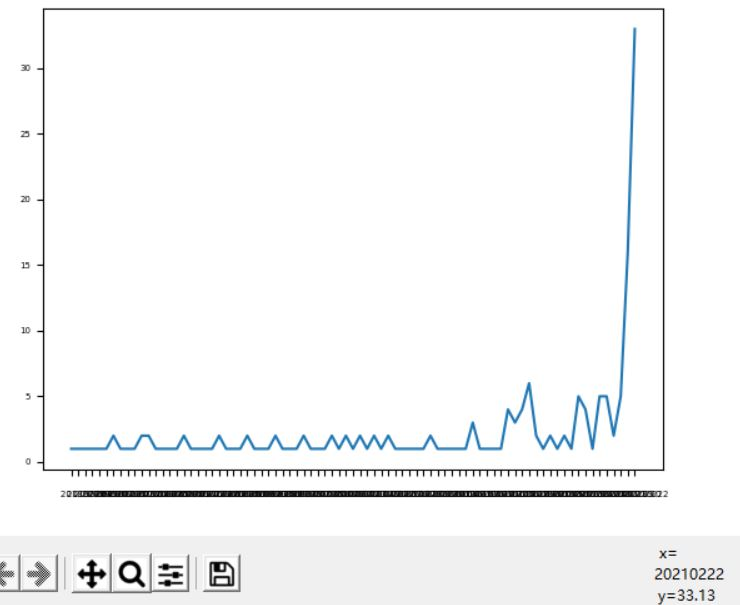
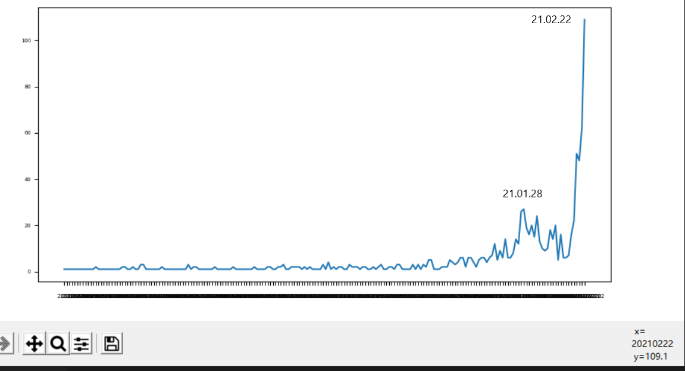

最近感觉b站讨论基金股票的声音越来越多，也有些分享自己投资经验的up主粉丝数达到了几十万，所以我想通过爬取b站搜索“股票”关键词后的投稿信息，探讨热度和时间的关系
  
注：搜索排序是按照综合，然后按页数爬取，最后进行统计
  
结果如下:
1-10页：

1-50页：

可以看到确实是爆发式增长，之前的一个增长点是在1月28号，然后我查看了一些基金情况，发现1月28号之前的几天连续跌了几天，而最近也是连续大跌。   

分析：  
从1月28号可以看出，跌与视频数有很强的相关性，而最近跌的也很多，而且是过完年开门就跌，而且是少数龙头企业基本都在跌而大部分都在涨，反常，这更刺激视频数目增长
  
结论：
  
热度有在增长但和跌的情况有很强的相关性（按理来说不是人人都在讨论股票时是因为最近股票涨得很猛吗，迷惑）